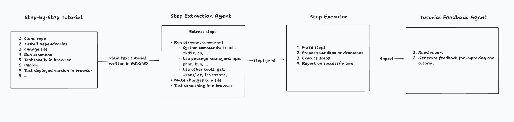

# Tutorial validator

The **tutorial validator** is a CLI tool that runs through your step-by-step tutorials as if it were a human! It helps you spot issues in the tutorial and provides feedbackl about what should be improved.

- ⚙️ Validates that a tutorial works as expected (can be used in CI)
- 🎓 Ensures instructions are clear for readers of all experience levels
- 💡 Generates feedback report with improvement suggestions

> **Note**: This project is under active development. If you have ideas for features or how to improve it otherwise, feel free to open an issue or reach out to [nikolasburk](https://x.com/nikolasburk) on X.

## Step-by-step tutorials are a great way to learn

Step-by-step programming tutorials are a great way to learn about new concepts/tools by practical example. They allow readers to understand new things gradually because they take the reader on a journey to build something in a well-defined, and deterministic, way. Sometimes, a tutorial has “checkpoints” along the way where the reader can test what they’ve built so far and validate that everything works as expected. For these kinds of tutorials, it’s very important that instructions are given in a precise, clear and unambiguous way.

## Problems with step-by-step tutorials

However, there are a few problems with these kinds of tutorials:

- they easily get out of date or break over time (e.g. because a new version of a tool it uses was released or someone makes a change to the tutorial itself but doesn’t actually validate the change afterwards)
- writers sometimes aren’t aware of the “readers mind”:
    - they maybe assume too much knowledge and don’t give instructions clearly enough so that the reader is left wondering what they actually need to do (e.g. when setting an environment variable)maybe execute an instruction in a false way (e.g. creating a file in a wrong directory)
    - it’s not clearly specified _where_ a certain change should happen, e.g. when a certain file should be changed but it’s not clear where in that file
    - certain steps are skipped because they seem too natural to be written down (e.g. a command to start an app so that it can be tested); this can especially trip up beginners/newcomers that otherwise have very little knowledge about the tool they’re trying to learn about
    - prerequisites aren’t explicit enough so that readers hit a wall at a certain point in the tutorial, e.g. because they don’t have a tool (or its correct version) installed
- readers may have different experience levels and what's implicitly understood by some, may not be by others

## Solution

The **tutorial validator** is a CLI tool that runs through a tutorial and executes all the instructions that are given in it.

There are three components to the **tutorial validator**:

- An **step extraction agent** that reads the tutorial and extracts the steps to represent them in some DSL
- A deterministic **tutorial step executo**r that receives the steps in that DSL, executes them in a sandbox environment and generates a report about which steps succeeded/failed
- A **tutorial feedback agent** that receives the report and generates improvement suggestions for the tutorial



## Design

The components are built independently from each other. Most importantly, the **tutorial step executor** is deterministic and can be used as a standalone tool if the steps are provided in the correct DSL. On the other hand, the **tutorial step extraction agent** and the **tutorial feedback agent** should be rather tightly coupled because they may want to communicate with each other to generate improvement suggestions (for example, the if a certain step failed, the **tutorial feedback agent** can check with the **tutorial step extraction agent** if it maybe misinterpreted a certain instruction in the tutorial to provide a suggestion for improvement).

### Types of steps

- Run terminal commands
  - System commands: `touch`, `mkdir`, `cp`, …
  - Use package managers: `npm`, `pnpm`, `bun`, …
  - Use other tools: `git`, `wrangler`, `prisma`, …
- Make changes to a file
  - Replace the entire contents of a file
  - Make a specific change to a file
    - Sometimes represented as `diff`
    - Sometimes only evident from context where the change should happen
- Validate to test for a certain outcome
  - Test something in a browser
  - Read CLI output

## Notes about tooling / requiremens / specs

- pnpm monorepo, two packages:
  ```
  packages/
  ├── tutorial-step-executor/          # Pure, deterministic execution engine
  │   ├── src/
  │   │   ├── dsl/               # DSL types and schema
  │   │   ├── executor/          # Step execution logic
  │   │   └── sandbox/           # Sandboxing utilities
  │   └── package.json
  │
  └── tutorial-agent/             # LLM-powered analysis
      ├── src/
      │   ├── extraction/        # Step extraction agent
      │   ├── feedback/          # Feedback generation agent
      │   ├── shared/            # Shared prompts, utilities
      │   └── cli.ts             # Main CLI entry point
      └── package.json
  ```
- TypeScript
- testing
  - unit tests in executor
  - e2e tests for agents
- sandboxing: 
  - use Docker for isolation
  - offer "local" mode where everything is run the user's local machine; use `/tmp` directory
- tutorial-step-executor can be used independently as a CLI

## Notes for LLM generating YAML

- escaping in yml
  - Since patterns contain:
  - `\\$` (causes errors in double quotes)
  - `''` (empty strings)
  - `\n` (newline escapes)
  - Literal newlines
  - Single quotes
  Use:

  Single quotes for patterns with `\\$`:
  ```yml
  searchPattern: 'const todos\\$ = queryDb\\(\\\(\\) => tables.todos.select\\(\\)\\)'
  ```

  Keep double quotes for patterns with `\n` newline escapes:
  ```yml
  searchPattern: "        </div>\n\n        <div className=\"space-y-3\">"
  ```

  Single quotes for patterns with single quotes inside (double the inner quotes):
  ```yml
  searchPattern: 'import tailwindcss from ''@tailwindcss/vite'''
  ```

  Keep double quotes for patterns with only backslashes (no `$`):
  ```yml
  searchPattern: "tailwindcss\\(\\),"
  ```
- don't assume prerequisite if it's a tool that's being installed in the tutorial (e.g. wrangler)
- if there's an instruction to run the app, include simple actions in the browser to test the app; generated the type of actions based on the current context